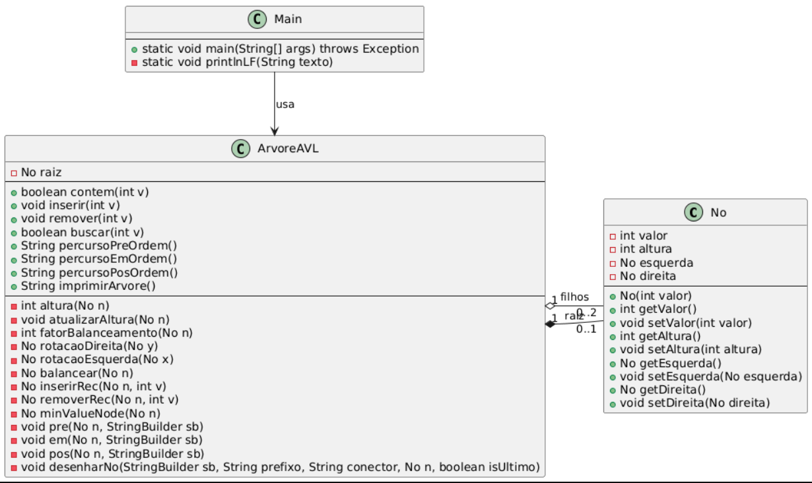
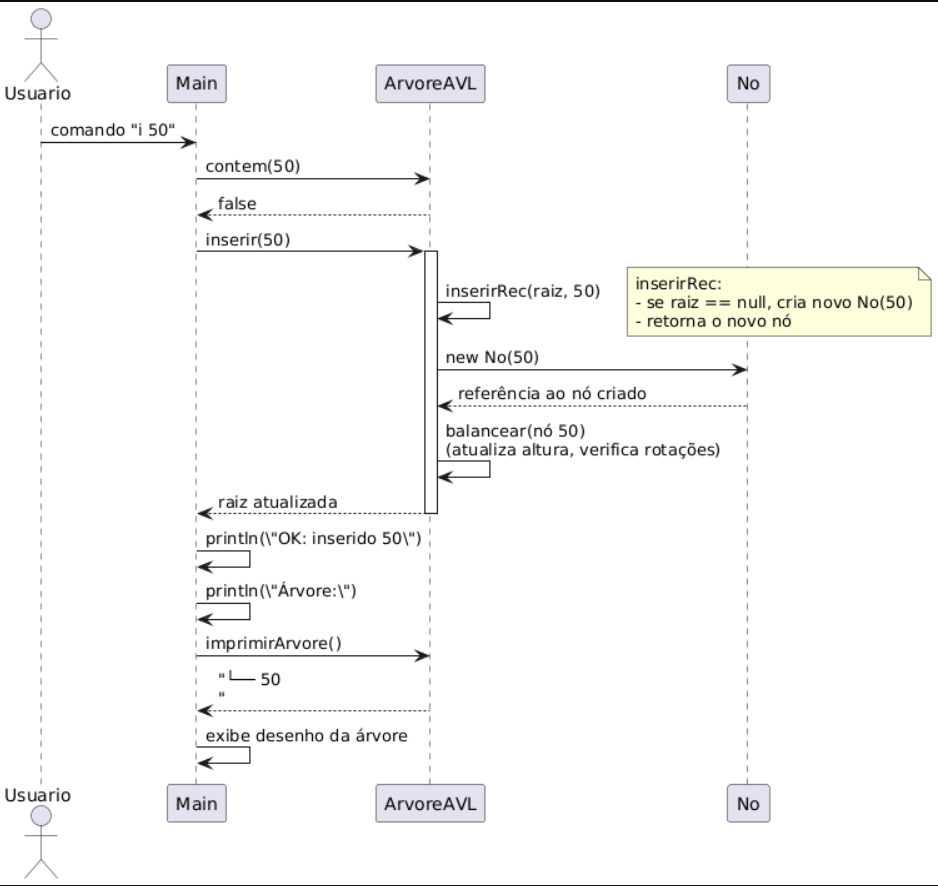
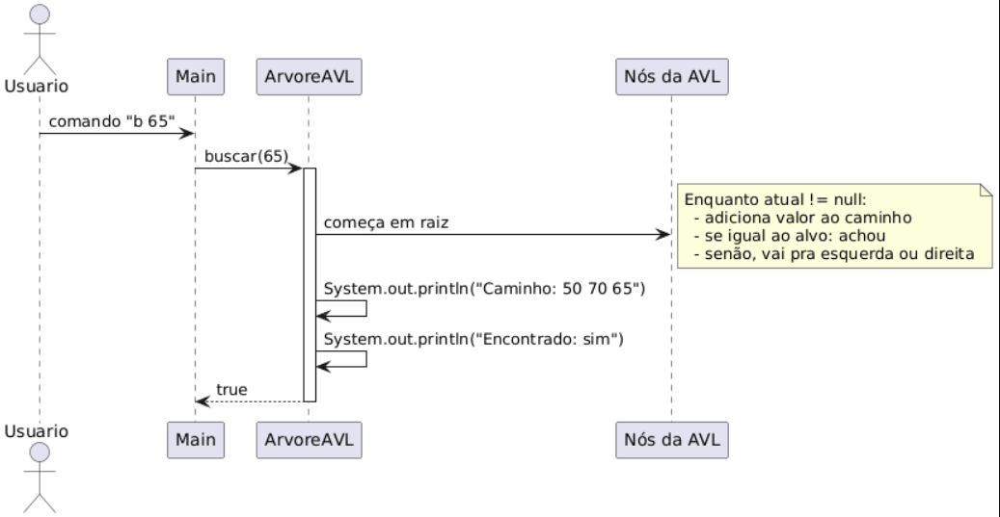
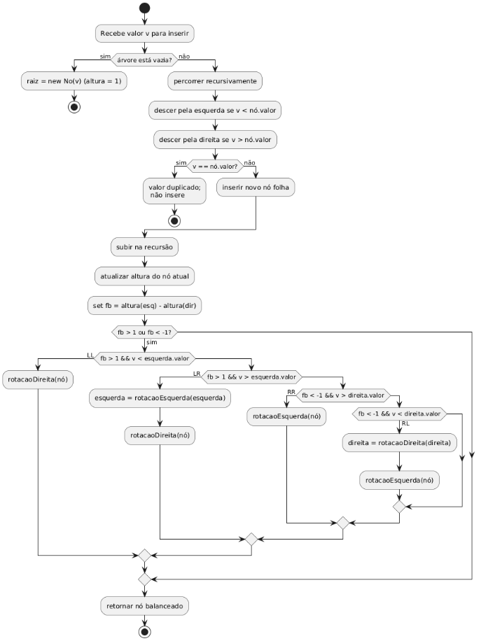
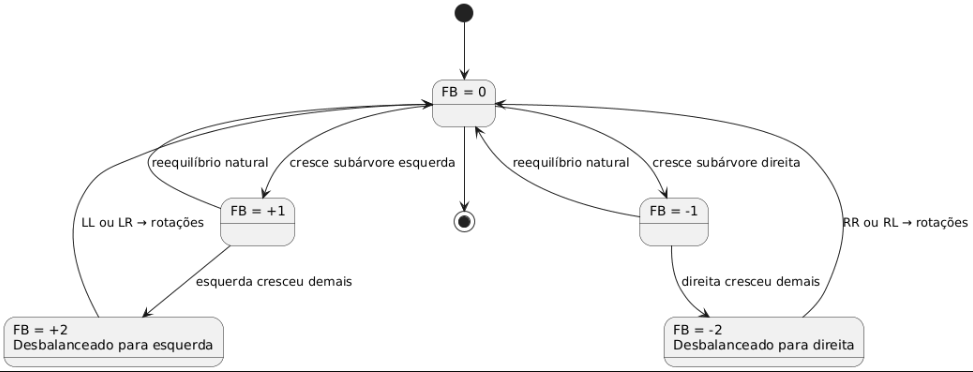

# Desafio - Estruturas de Dados - Java: Árvores AVL

## Propósito do Projeto

Este desafio consolida os conhecimentos sobre Árvores AVL — uma estrutura de dados que mantém o equilíbrio automaticamente após inserções e remoções, garantindo operações eficientes de busca. O projeto tem como objetivo implementar e validar a árvore AVL utilizando Java, respeitando o contrato fornecido no validador oficial.

**Atividades principais:**

* Implementar a AVL para inteiros;
* Executar inserção, remoção e busca com reequilíbrio automático;
* Exibir percursos em pré-ordem, em-ordem e pós-ordem;
* Imprimir o desenho da árvore após inserções e remoções, e o caminho durante as buscas.

## Ferramentas e Ambiente

* **Linguagem:** Java (JDK 17)
* **IDE:** BlueJ / VS Code
* **Sistema de validação:** `Validador.java` (fornecido com o enunciado)
* **Testes:** Automatizados de contrato e casos de mesa (3 cenários)
* **Ambiente:** Codificação e testes executados localmente em Windows 10 | 11.

## Como Executar

Existem duas formas de compilar e executar o projeto:

### 1. Usando BlueJ (Conforme o enunciado)

1.  Abra o projeto no BlueJ.
2.  Compile todas as classes (`Compile All`).
3.  Execute `Validador.main()` para rodar os testes automáticos.
4.  O console exibirá os resultados dos contratos e dos três casos de teste.
    * Caso todos apareçam como “OK”, a implementação está 100% conforme o desafio.

### 2. Usando VS Code (ou Terminal / Git Bash)

1.  Abra a pasta do projeto no VS Code.
2.  Abra um terminal (recomendado: **Git Bash**).
3.  Navegue até a pasta de código-fonte:
    ```bash
    cd src
    ```
4.  Compile o projeto:
    ```bash
    javac *.java
    ```
5.  Execute o `Validador`:
    ```bash
    java Validador
    ```
6.  A saída esperada é `OK` para "Contratos essenciais" e "Testes de mesa".

## Estrutura do Projeto

* `src/No.java` → Representa os nós da árvore (valor, altura, filhos esquerdo/direito).
* `src/ArvoreAVL.java` → Contém os métodos de inserção, remoção, busca, balanceamento e percursos.
* `src/Main.java` → Interface textual para execução manual (lê comandos como `i 45`, `r 20`, etc.).
* `src/Validador.java` → Valida automaticamente as classes e métodos contra os requisitos.
* `src/README.txt` → Documentação do projeto.
* `src/*.png` → Diagramas UML do projeto.
* `tests/` → Pasta contendo os 3 casos de teste (`.in`) e seus respectivos gabaritos (`.out`).

## Diagramas UML

(Conforme arquivos na pasta `src/`)

**Diagrama de Classes:**


**Fluxo de Inserção (Sequência):**


**Fluxo de Busca (Sequência):**


**Fluxo de Atividade (Inserção):**


**Fluxo de Atividade (Remoção):**
![Atividade de Remoção]
(src/UML_RemoçãoAVL.png)

**Fluxo de Estado (Fator de Balanceamento):**


## Autores

* Larissa Matos Lima
* Vitor Rodrigues da Rosa

## Responsabilidades

Larissa Lima e Vitor Rodrigues desenvolveram os códigos, revisaram, testaram os resultados e construíram os diagramas UML do projeto.
Tentamos cntato com a colega Adriana sem sucesso.

## Versão

28/10/2025
